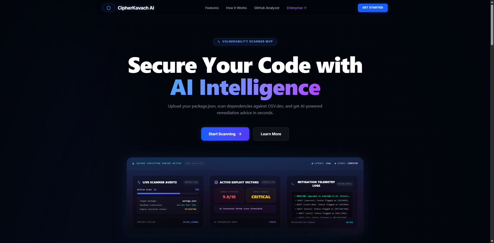
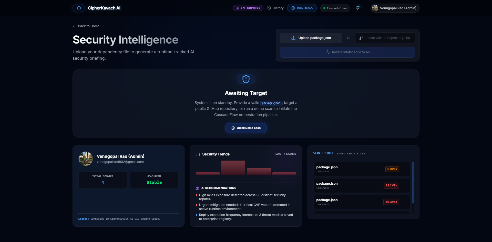
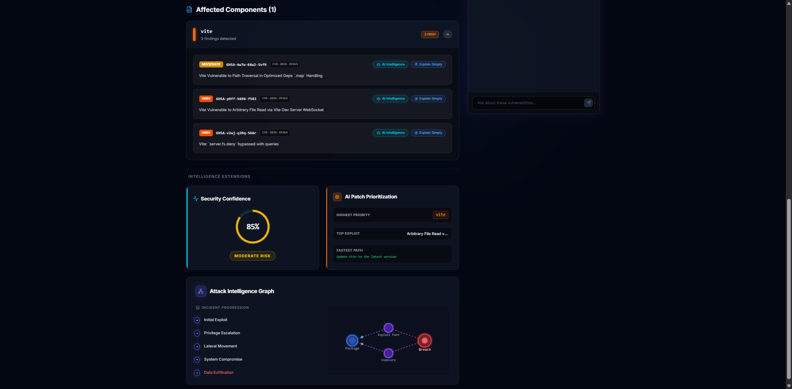
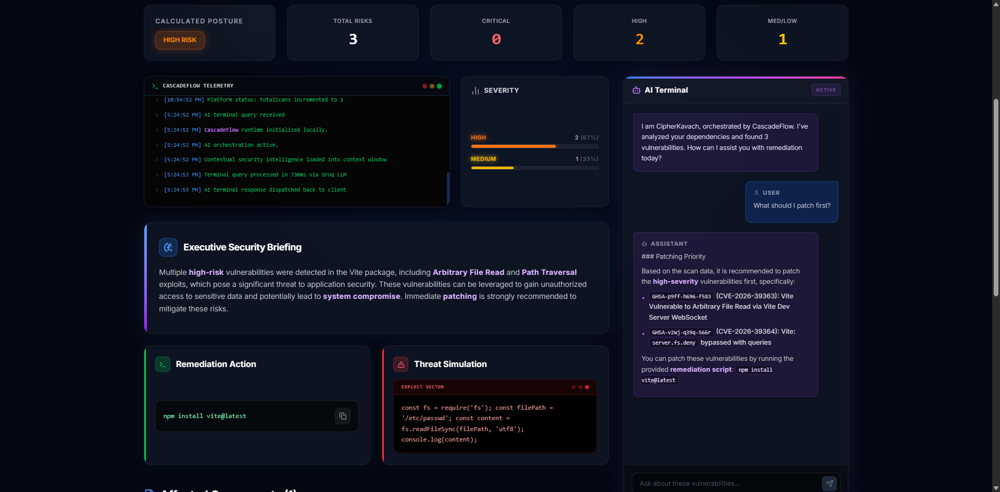
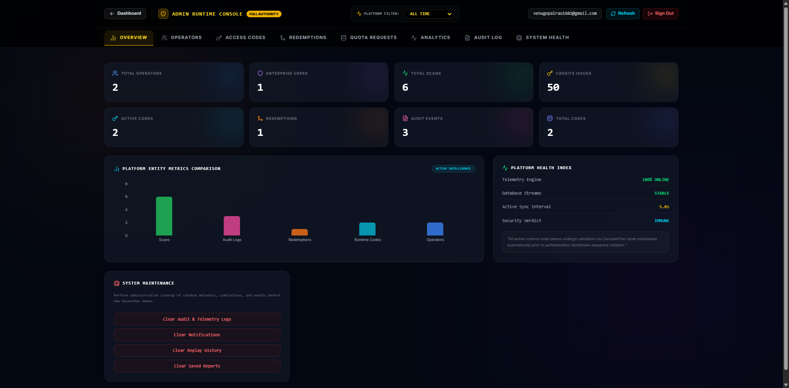
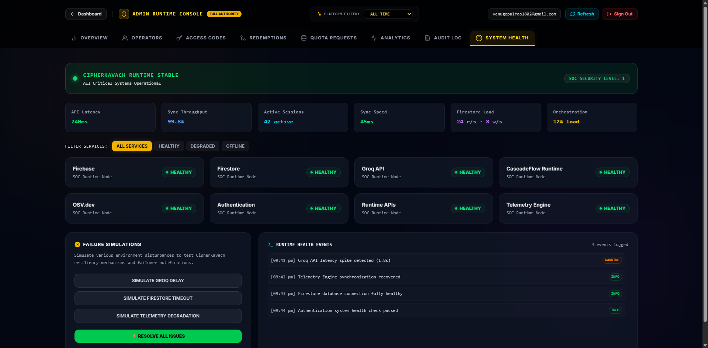
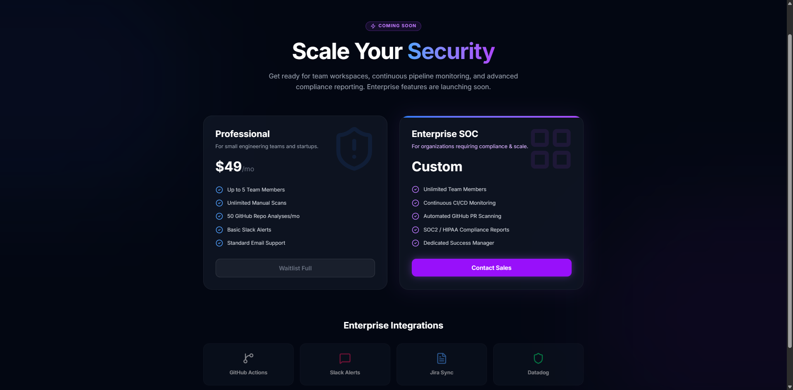
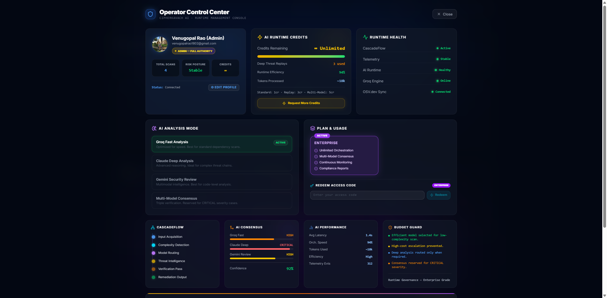
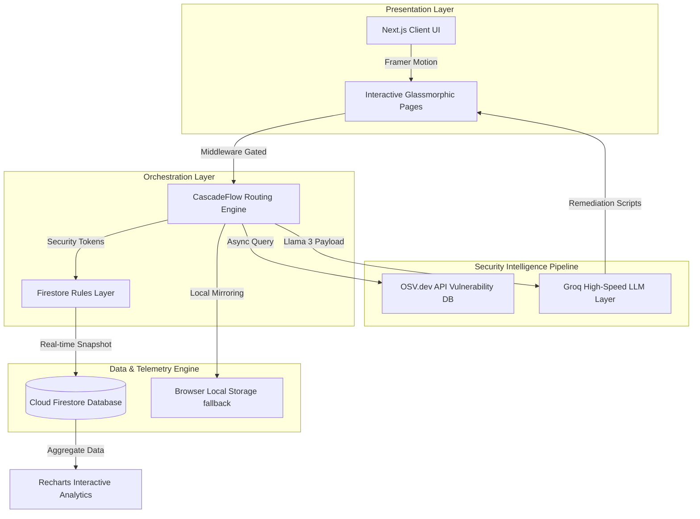

# 🛡️ CipherKavach AI
### *Context-Aware Dependency Vulnerability & AI Threat Intelligence Platform*

[](https://nextjs.org/)
[](https://www.typescriptlang.org/)
[](https://firebase.google.com/)
[](https://tailwindcss.com/)
[](https://groq.com/)
[](https://osv.dev/)

---

## ⚡ The Enterprise Cybersecurity Paradigm

Modern software development relies heavily on third-party libraries—introducing complex transitives and insecure packages into critical production systems. Traditional vulnerability scanners only generate endless tables of security warnings, leading to alert fatigue and delayed remediations.

**CipherKavach AI** is a premium, startup-grade cybersecurity platform that bridges the gap between identification and remediation. Engineered with Next.js 15, Firestore, OSV.dev, and the **CascadeFlow AI Orchestration Engine**, CipherKavach AI performs deep dependency scans, correlates real-time CVE threat matrices, and generates contextual, drop-in remediation patches via Groq-powered AI models instantly.

---

## 🚀 Live Demo & Repository Links

*   **⚡ Live Production URL:** [https://cipherkavach-ai.vercel.app/](https://cipherkavach-ai.vercel.app/) *(Placeholder)*
*   **💻 GitHub Source Code:** [https://github.com/venugopal-hue/CipherKavach-AI](https://github.com/venugopal-hue/CipherKavach-AI)
*   **📰 Full Engineering Article:** [Read on Medium](https://medium.com/@venugopalrao1802/my-ai-security-runtime-burned-through-credits-faster-than-the-vulnerabilities-b5a75d3d46f7)

---

## ✨ Features Engineered for the Modern SOC

*   **🛡️ Context-Aware AI Scan Pipeline:** Upload any `package.json` manifest or supply a GitHub repository link to instantly run vulnerability scans cross-referenced with the global Google OSV.dev vulnerability database.
*   **🧠 CascadeFlow Intelligence Routing:** Custom multi-model AI routing orchestration that analyzes security alerts, scores threat priorities, and evaluates context before calling the Groq LLM layer.
*   **⚡ Drop-in Remediation Assistant:** Interactive AI security chat preloaded with context from your specific scan results. Instantly drafts safe package upgrades and security wrapper scripts.
*   **📊 Premium Security Analytics:** Stunning interactive charting (built with Recharts) visualizing threat scores, exploit progression timelines, and patch priorities.
*   **👑 Admin Runtime Console:** Real-time administrative controls to monitor users, issue single-use credits/access keys, track live audit logs, and inspect platform system health metrics.
*   **🔑 Secure Access Token System:** Role-based access control (RBAC) with credit limits, enterprise unlocks, and single-use redemption codes to manage platform traffic and governance.
*   **📋 Compliant Telemetry Logging:** System audit trails capturing actor, target, severity, and action schemas in Firestore, fully compliant with modern compliance protocols (SOC2/GDPR-ready structures).
*   **📱 Ultra-Premium Dark Aesthetics:** A high-fidelity, responsive, glassmorphic UI styled with deep space gradients, futuristic micro-animations (Framer Motion), and harmonious HSL color systems.

---

## 📸 High-Fidelity Product Showcase

### 🌌 1. The Gateway Portal (Landing Page)
An immersive, interactive landing page introducing developers and security executives to the platform's core threat intelligence capabilities.


### 📊 2. Main Executive Dashboard
A unified overview for security operators summarizing active package alerts, threat distributions, and live telemetry.


### 📈 3. Deep Analytics Console
A robust visualization suite analyzing patch hierarchies, impact severity, and historical security progressions.


### 🔍 4. Vulnerability & Scan Intelligence
Detailed, granular breakdown of detected vulnerabilities with interactive AI remediation sidebars.


### 👑 5. Unified Admin Command Center
A comprehensive administrative console that manages platform operators, issues runtime codes, and regulates active API quotas.


### 🛠️ 6. System Diagnostics & Health Status
Live tracking of platform telemetry engines, database sync latency, and active middleware checks.


### 💳 7. Enterprise Licensing
Premium, glassmorphic tier breakdowns detailing standard and advanced enterprise support pipelines.


### 👤 8. Operator Profile Settings
Customizable operator profiles containing credit metrics, access privileges, and secure avatar hooks.


---

## 🏗️ Architectural Topology

CipherKavach AI is designed with a decoupled, modular schema to optimize data-flow performance, guarantee Firestore security compliance, and stream high-speed AI payloads:



---

## 🧠 The AI Pipeline & CascadeFlow Engine

CipherKavach AI utilizes a modern, pipeline-based approach to threat intelligence routing:

```
[Upload Manifest] ➔ [OSV.dev REST Query] ➔ [Vuln JSON Synthesis] ➔ [CascadeFlow Context Enricher] ➔ [Groq High-Speed LLM Inference] ➔ [Context-Aware Patches]
```

1.  **Vulnerability Ingestion:** When a `package.json` file is parsed, CipherKavach queries the **OSV.dev API** for every dependency name and version range, fetching highly accurate CVE/GHSA definitions.
2.  **Context-Aware Aggregation:** CascadeFlow groups these vulnerabilities, calculates a unified platform Threat Score, and filters out duplicate notices to prevent alert fatigue.
3.  **High-Speed AI Inference:** The synthesized payload is parsed with instructions into our custom Groq Llama 3 context window, returning structured security prioritization guides, exploit walkthroughs, and safe replacement snippets in sub-500ms intervals.

---

## 🛡️ Enterprise Security & Telemetry Compliance

CipherKavach AI is built to replicate the controls required by large security operations teams:
*   **Audit Logging:** Every administrative action—like changing operator roles, granting/deducting credits, and clearing historical logs—writes a secure, unalterable event document to Firestore.
*   **Log-Clearing Controls:** A compact **System Maintenance** panel allows authorized administrators to clear historical logs or reset environments cleanly under secure confirmation dialogs.
*   **Quota Governance:** Standard accounts are rate-limited via client-side fingerprint lockouts and Firebase database counters, instantly resettable under the user settings panel.

---

## 💻 Technical Stack & Ecosystem

| Technology | Role | Details |
| :--- | :--- | :--- |
| **Next.js 15** | Application Framework | App Router, React Server Components, Route Handlers |
| **TypeScript** | Language | Static typing, interface architectures, type safety |
| **Firebase Auth** | Identity Provider | Secure operator credential validation & role assignment |
| **Cloud Firestore** | Database | Real-time streams, security rules, compliance records |
| **Tailwind CSS** | Styling | Custom glassmorphism, grid layouts, fluid utility classes |
| **Framer Motion** | Animation | High-fidelity micro-interactions, layout transitions |
| **Groq API** | AI Core | High-performance inference engine running Llama 3 models |
| **OSV.dev** | Threat Database | Dynamic Google Open Source Vulnerabilities database API |
| **Recharts** | Data Vis | SVG/Canvas charts tracking platform vulnerabilities |

---

## 🛠️ Installation & Local Setup

### Prerequisites
*   Node.js (v18.x or newer recommended)
*   npm or yarn
*   A Firebase project configured with Authentication and Firestore

### Step-by-Step Installation

1.  **Clone the Repository:**
    ```bash
    git clone https://github.com/venugopal-hue/CipherKavach-AI.git
    cd CipherKavach-AI
    ```

2.  **Install Project Dependencies:**
    ```bash
    npm install
    ```

3.  **Configure Environment Variables:**
    Create a `.env.local` file in the root directory and insert your credentials:
    ```env
    # Firebase Web Configuration
    NEXT_PUBLIC_FIREBASE_API_KEY=your_api_key
    NEXT_PUBLIC_FIREBASE_AUTH_DOMAIN=your_auth_domain
    NEXT_PUBLIC_FIREBASE_PROJECT_ID=your_project_id
    NEXT_PUBLIC_FIREBASE_STORAGE_BUCKET=your_storage_bucket
    NEXT_PUBLIC_FIREBASE_MESSAGING_SENDER_ID=your_messaging_sender_id
    NEXT_PUBLIC_FIREBASE_APP_ID=your_app_id

    # Groq AI Orchestration API Key
    GROQ_API_KEY=your_groq_api_key
    ```

4.  **Configure Firestore Security Rules:**
    Deploy the rules provided in `firestore.rules` directly to your Firebase Console:
    ```bash
    firebase deploy --only firestore:rules
    ```

5.  **Run Development Server:**
    ```bash
    npm run dev
    ```
    Open [http://localhost:3000](http://localhost:3000) inside your browser to access the local environment.

6.  **Build Production Bundle:**
    ```bash
    npm run build
    ```

---

## 🔑 Sandboxed Demo Access

For evaluators, developers, and security operators, a pre-seeded Admin & Operator sandbox account is available.

*   **Demo Email:** `demo@cipherkavach.ai`
*   **Demo Password:** `Cipher123`

> [!NOTE]
> *This environment is intended for evaluation and demonstration purposes. It features rate-limiting bypasses to ensure a seamless showcase.*

---

## 🗺️ Platform Future Roadmap

*   **🔮 CI/CD pipeline integration:** Standardized GitHub Action and GitLab CI templates to scan package manifests during merge requests automatically.
*   **🧠 Multi-Model Consensus Orchestration:** Upgrade CascadeFlow to poll multiple LLMs (Llama 3, Claude, GPT-4) in parallel, selecting the most secure patch via consensus scoring.
*   **🛡️ Dynamic Sandbox Exploit Simulation:** Launch micro-containers in safe sandboxes to execute scanned vulnerabilities, validating CVE exploits safely before deployment.

---

## 🤝 Contributing to the Platform

We welcome open-source contributions from security engineers, researchers, and frontend developers alike.
1. Fork the repository.
2. Create your feature branch (`git checkout -b feature/SecurityUpgrade`).
3. Commit your changes (`git commit -m 'Added custom CVE telemetry hook'`).
4. Push to the branch (`git push origin feature/SecurityUpgrade`).
5. Open a Pull Request.

---

## 📄 License
This project is open-source and licensed under the [MIT License](LICENSE).

---

## ✍️ Author & Lead Architect
*   **Venugopal Rao** - Lead Product & Cybersecurity Architect
    *   *GitHub:* [@venugopal-hue](https://github.com/venugopal-hue)
    *   *LinkedIn:* [Venugopal Rao](https://www.linkedin.com/in/venugopalrao2006india/)

---
<p align="center">
  Developed with ❤️ as a premium secure threat intelligence platform.
</p>
